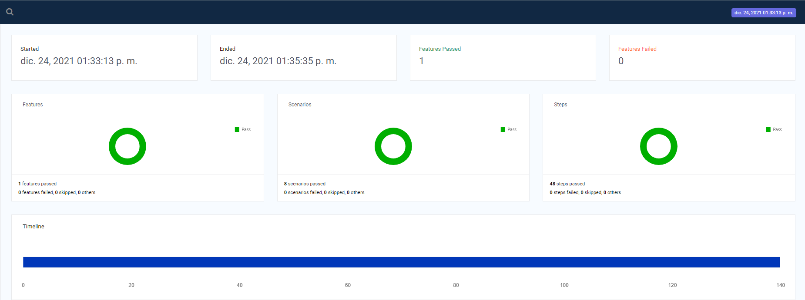

# Selenium Path

```bash
URL: http://practice.automationtesting.in/
```
## Dependencies
* Cucumber 7.1.0
## Installation

```bash
npm install
```

## Run Test

## Test-Cases

### - My Account - Login

1. Log-in with valid username and password.
2. Log-in with incorrect username and incorrect password.

## Reports 
ExtentReport Adapter 
URL: https://ghchirp.tech/3196/


## Contributing

## License
